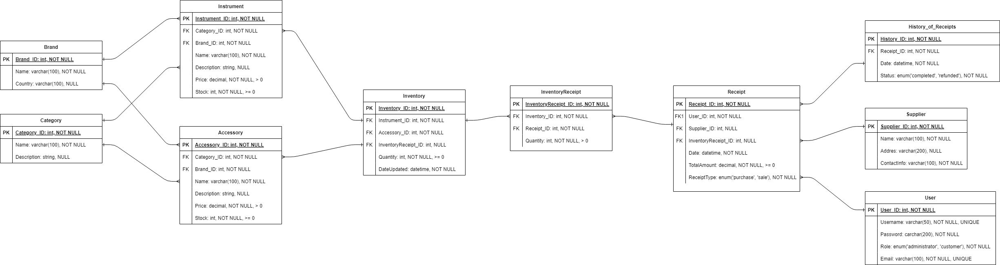
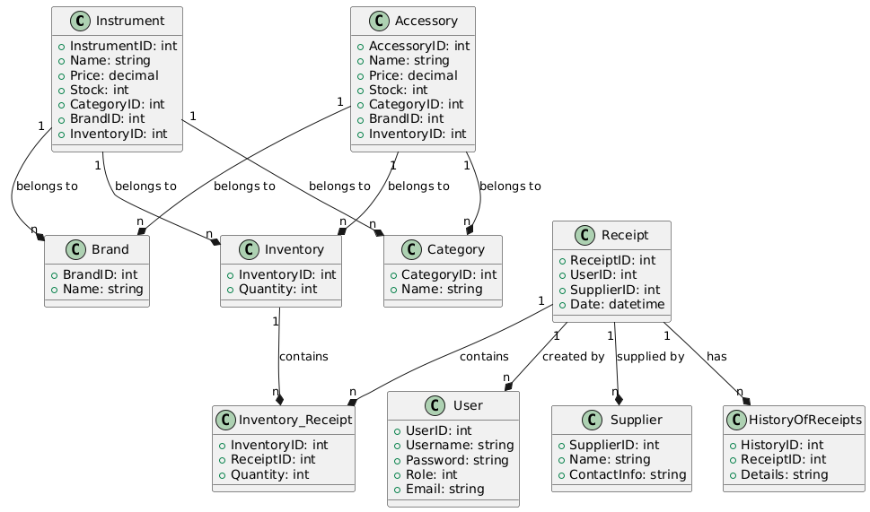

# **Music Store Management Application - Database Design**

## Team Members

- *Esteban Villalba Delgadillo - 20212020064*
- *Santiago Marin Paez - 20231020159*

## Project Information

**Professor:** *Engineer Carlos Andrés Sierra Virgüez*  
**Career:** *Systems Engineer*  

## Introduction

This project focuses on the design and implementation of a **relational database** for a virtual music store management application. The database supports functionalities such as product management, inventory tracking, user registration, and transaction recording. It serves as the foundation for future development of the application.

---

## **Table of Contents**
1. [Project Overview](#project-overview)
2. [Database Design](#database-design)
3. [Entity-Relationship Diagram (ERD)](#entity-relationship-diagram-erd)
4. [Class Diagram](#class-diagram)
5. [Technologies Used](#technologies-used)
6. [Setup Instructions](#setup-instructions)
7. [API Endpoints](#api-endpoints)
8. [Future Improvements](#future-improvements)
9. [Contributors](#contributors)

---

## **Project Overview**
The database is designed to manage the following core functionalities:
- **Product Management**: Store and manage information about musical instruments and accessories.
- **Inventory Tracking**: Track stock levels and update inventory.
- **User Management**: Register users and assign roles (e.g., admin, customer).
- **Transaction Recording**: Record purchases and generate receipts.
- **Supplier Management**: Manage supplier information and orders.

The database is implemented using **PostgreSQL** and tested via **FastAPI** endpoints. The project is containerized using **Docker** for easy setup and deployment.

---

## **Database Design**
The database consists of the following tables:
- **Instrument**: Stores information about musical instruments.
- **Accessory**: Stores information about musical accessories.
- **Category**: Categorizes products (e.g., guitars, drums).
- **Brand**: Stores brand information for products.
- **Inventory**: Tracks product stock levels.
- **Receipt**: Records purchase transactions.
- **HistoryOfReceipts**: Stores historical data about receipts.
- **User**: Manages user accounts and roles.
- **Supplier**: Stores supplier information.
- **Inventory_Receipt**: Resolves the many-to-many relationship between `Inventory` and `Receipt`.

---

## **Entity-Relationship Diagram (ERD)**
Below is the Entity-Relationship Diagram (ERD) for the database:



---

## **Class Diagram**
The Class Diagram represents the structure of the database tables and their relationships:



---

## **Technologies Used**
- **Database**: PostgreSQL
- **API Framework**: FastAPI
- **Containerization**: Docker
- **Programming Language**: Python
- **Design Tools**: Lucidchart (for ERD and Class Diagrams)

---

## **Setup Instructions**
Follow these steps to set up the project locally:

### **Prerequisites**
- Docker installed on your machine.
- Docker Compose installed.

### **Steps**
1. Clone the repository:
   ```bash
   git clone https://github.com/your-username/DatabaseFoundations_FinalProject.git
   cd DatabaseFoundations_FinalProject
    ```
2. Start the Docker containers:

```bash
docker-compose up -d
```
3. Access the FastAPI documentation:
- Open your browser and go to http://localhost:8000/docs.

4. Run database migrations (if applicable):

```bash
docker exec -it <container_id> python manage.py migrate
```
5. Test the API endpoints using the FastAPI interactive docs.

### **API Endpoints**
The following endpoints are available for testing the database:

#### Users

- Create User: POST /users

- Get User by ID: GET /users/{user_id}

- Update User: PUT /users/{user_id}

- Delete User: DELETE /users/{user_id}

#### Products

- Create Product: POST /products

- Get All Products: GET /products

- Get Product by ID: GET /products/{product_id}

#### Inventory
- Update Inventory: PUT /inventory/{inventory_id}

#### Receipts
- Create Receipt: POST /receipts

- Get Receipt History: GET /receipts/history

### Future Improvements
- Implement a shopping cart feature.

- Add support for promotional discounts and multiple payment methods.

- Integrate the database with a frontend application (web or mobile).

- Optimize database performance for large datasets.

